## Windows

### 1. 下载安装包

因为下载安装包需要一定的时间，所以先把进行安装包的下载。
可以去官网下载：[Download Flutter](https://flutter.io/sdk-archive/#windows)
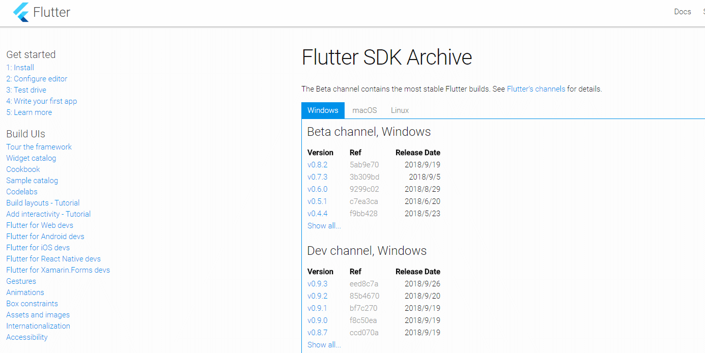
可以去 Flutter github 下载安装包：[Download Flutter Zip](https://github.com/flutter/flutter/releases)

### 2. 配置环境变量

```
PUB_HOSTED_URL = https://pub.flutter-io.cn
FLUTTER_STORAGE_BASE_URL = https://storage.flutter-io.cn
```

在 **等待下载** 过程中配置一下环境变量

1. 右键我的电脑(此电脑) > 属性 > 高级系统保护设置 > 高级 > 环境变量
   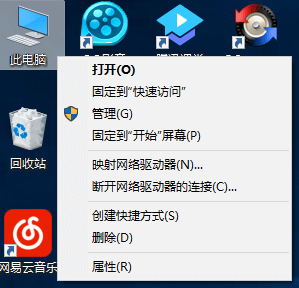
   

2. 在 系统变量 下点击新建（可以将上面代码复制）：
   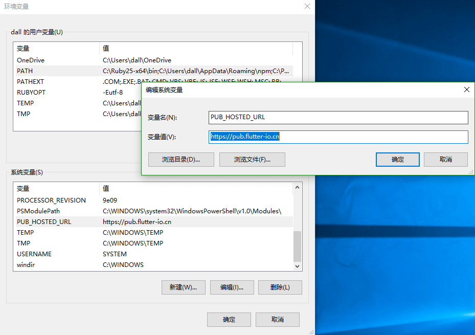
   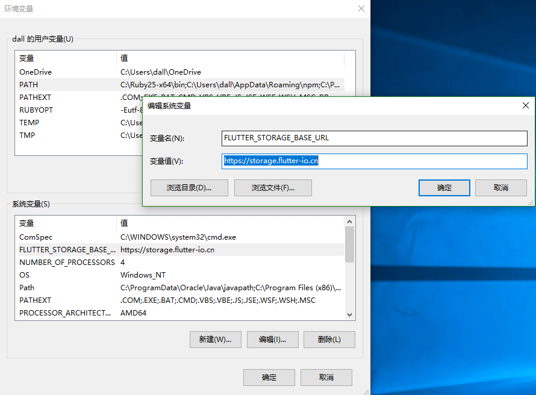

在 **下载完安装包** 后，

1. 把它解压到你想安装 Flutter SDK 的路径（我是在 `C:\src\flutter`）
   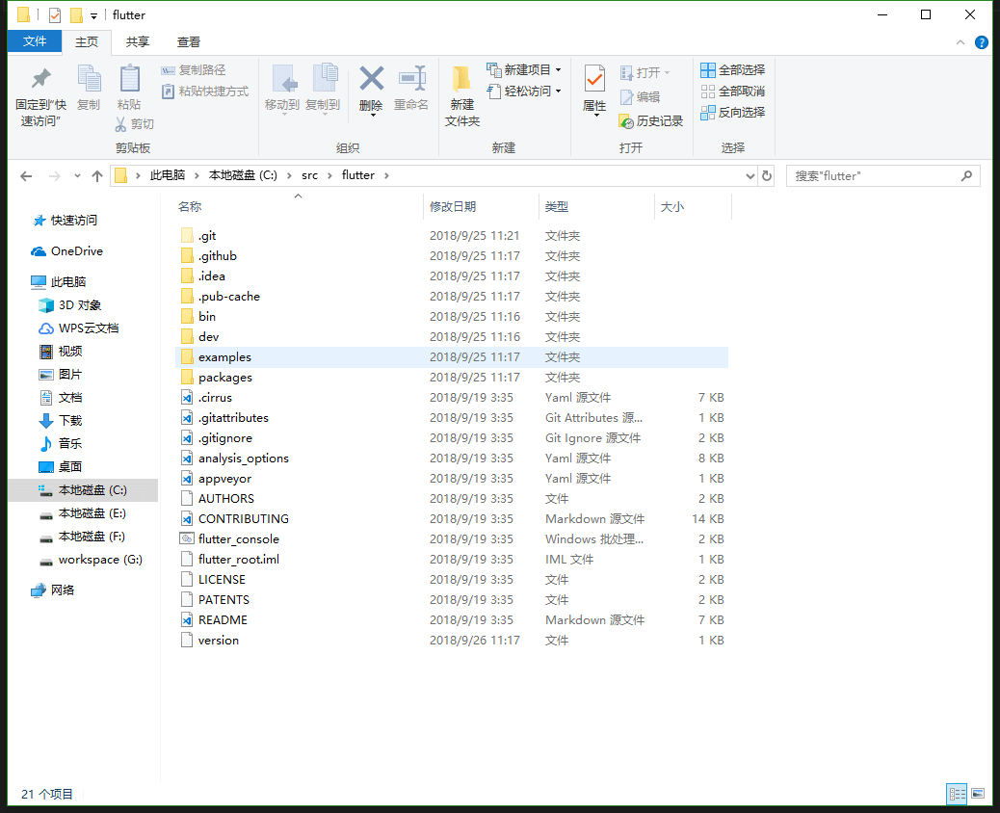
2. 在 系统变量 下检查是否有名为“Path(PATH)”的条目:
   a. 如果该条目存在，左键双击击进入该项 编辑 > 新增
   b. 如果条目不存在, 点击下面 新建, 变量名为 `Path` ，变量值为 `C:\src\flutter\bin`
   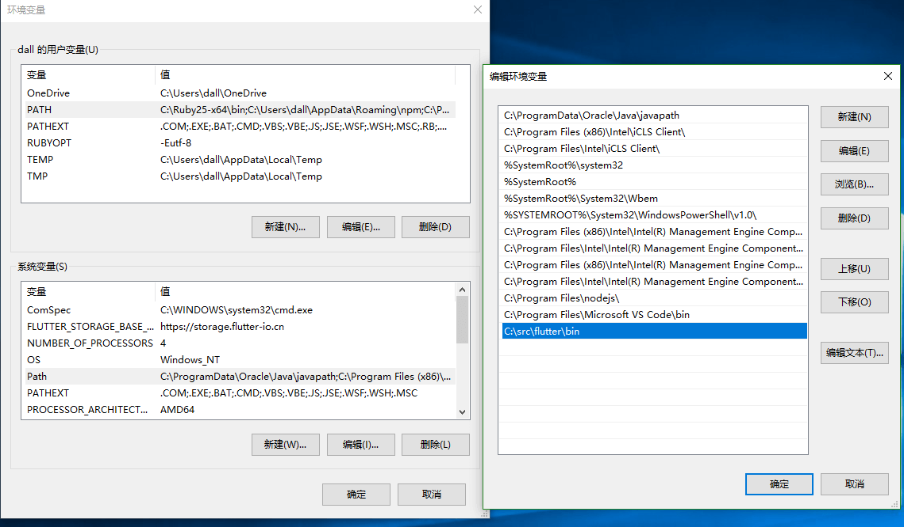

### 3. 运行 Flutter doctor

1. 打开 Flutter console
   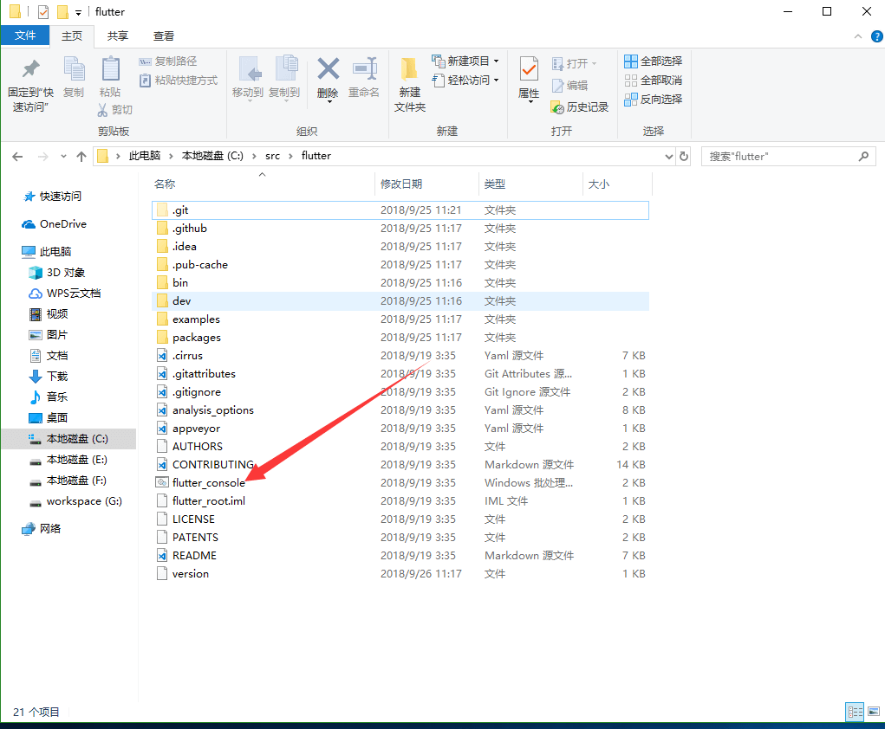
   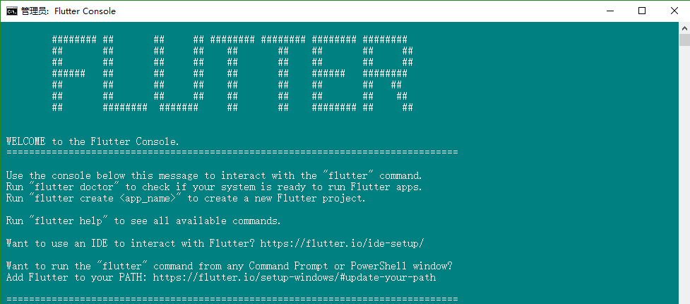

2. 输入 `flutter doctor`, 检查还需要安装的项目
   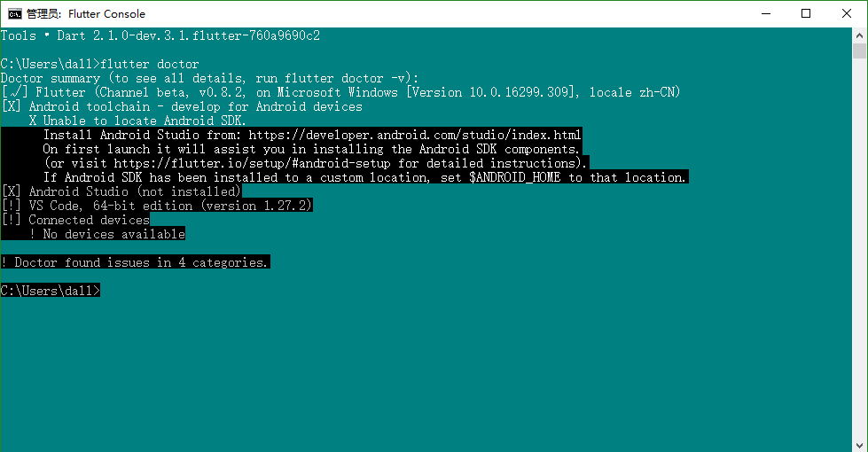
   如上图，显示 [X] 的为没有安装的项目
   - 如果是前端仔，建议用 VScode，跳到 [VSCode Flutter 配置](#配置VSCode)
   - 如果是安卓仔，那就直接可以用 Android Studio

### 4. 配置 VSCode

1. 打开命令面板(快捷键：`Ctrl + Shift + P`)
2. 安装扩展，搜索 flutter
   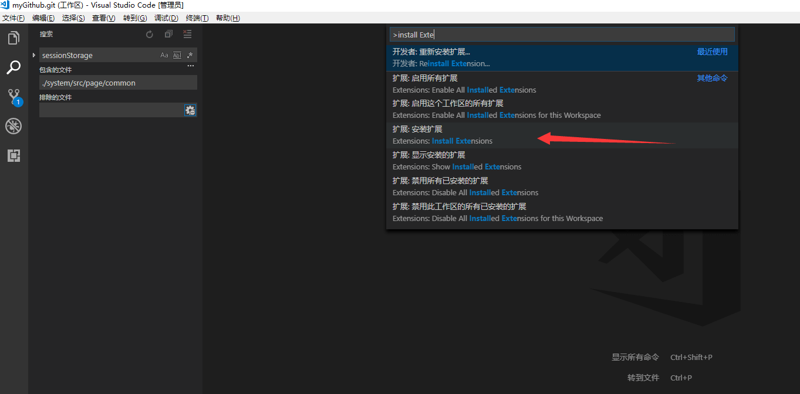
   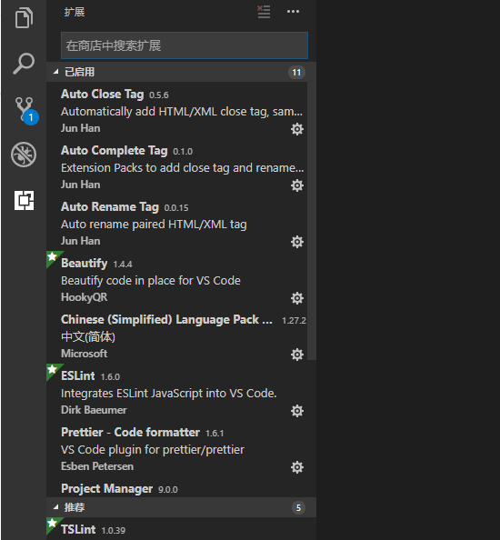
   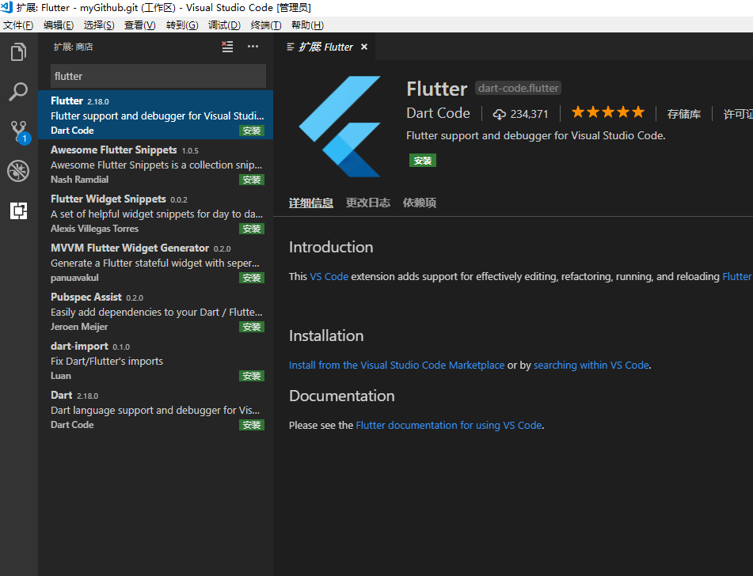
   点击安装，发现 Dart 也一起安装好了
   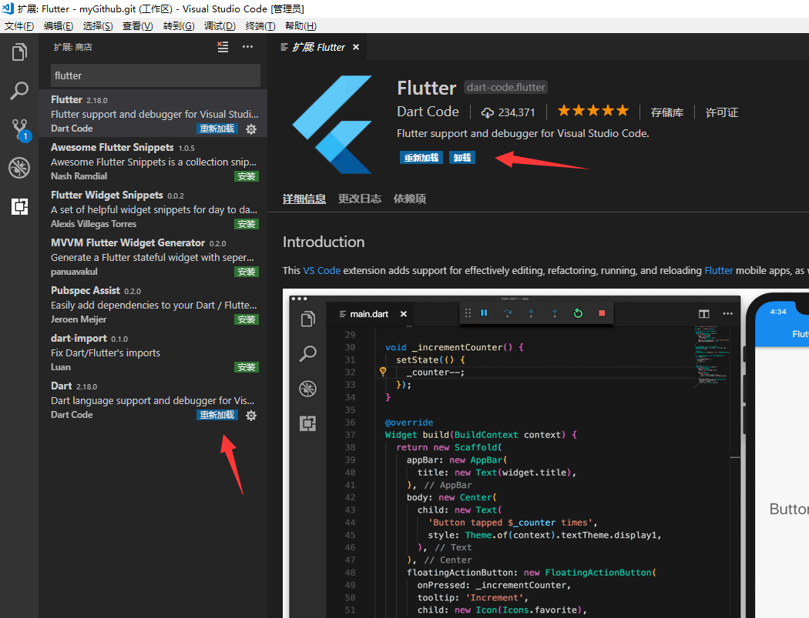
3. 验证
   - 打开命令面板
   - 输入 'doctor'，选择 'Flutter: Run Flutter Doctor'
   - 查看 “OUTPUT” 窗口中的输出是否有问题
     
4. 创建项目
   - 打开命令面板
   - 选择 'Flutter: New Project'
     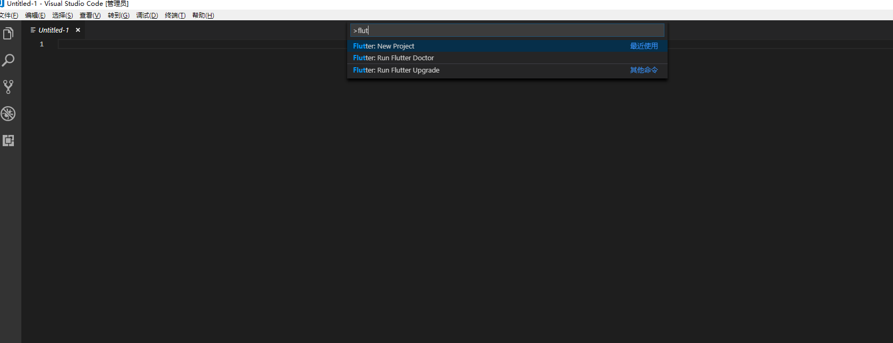
   - 项目命名，遵循谷歌**下划线命名**，使用**驼峰命名会报错**
     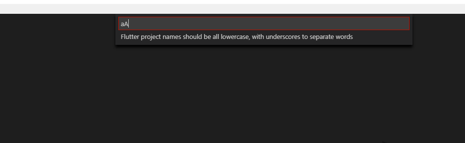

### 5. 配置移动设备

1. 将自己的手机连接到电脑，打开发者模式（连续点击版本号）
   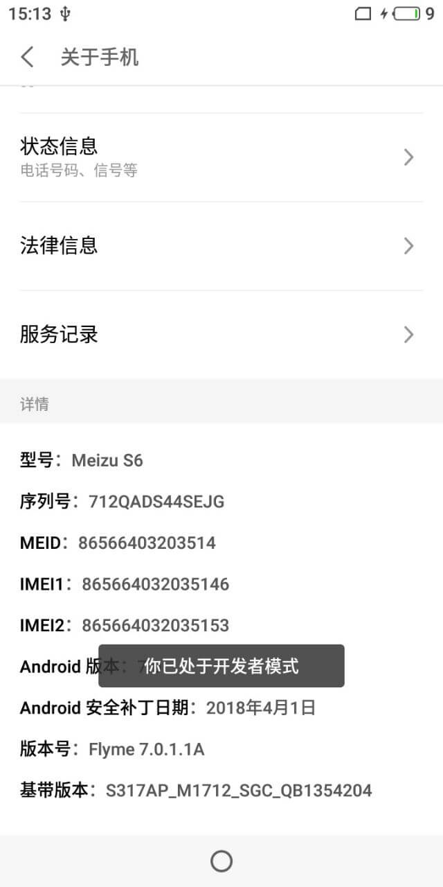
2. 进入开发者选项，打开 USB 调试（不同手机'开发者选项'在不同位置，自行百度）
3. 检查是否连接成功
   
4. 按 F5 键或点击 调试>启动调试(Debug>Start Debugging)，等待手机出现画面
   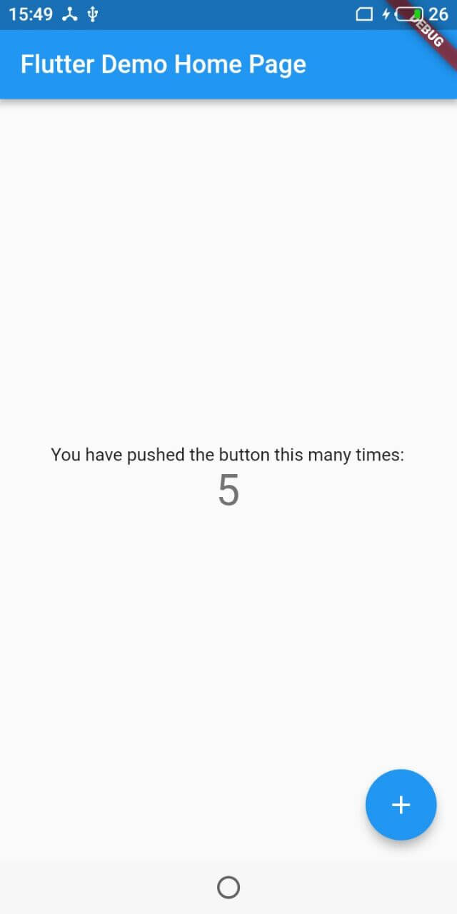
5. 体验热重载
   - 打开 `main.dart`文件
   - 找到 `home: new MyHomePage(title: 'Flutter Demo Home Page')`,
   - 把 `title` 里的内容改为 `VSCode Flutter Demo`
     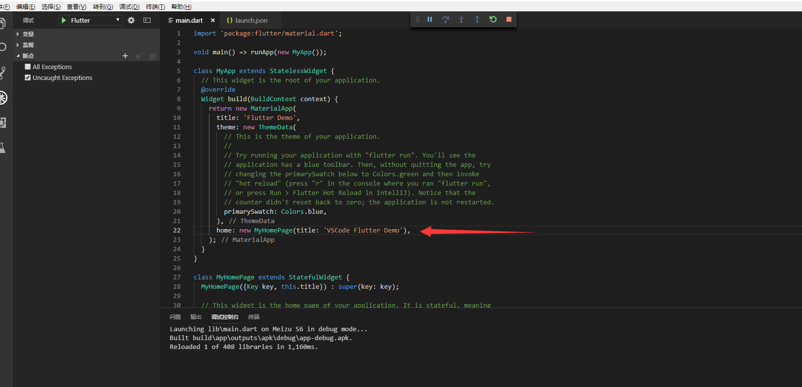
   - 保存(`ctrl-s`)， 就可以在手机上看到更改了
     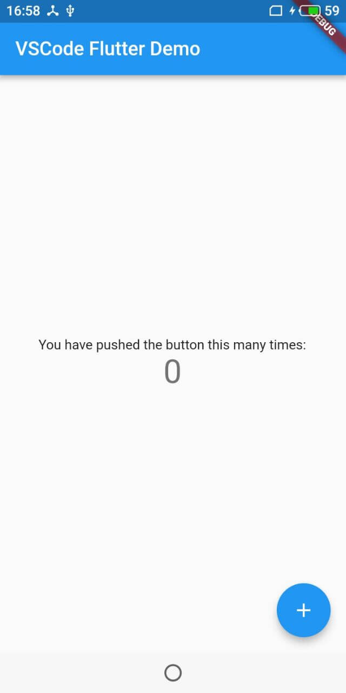
