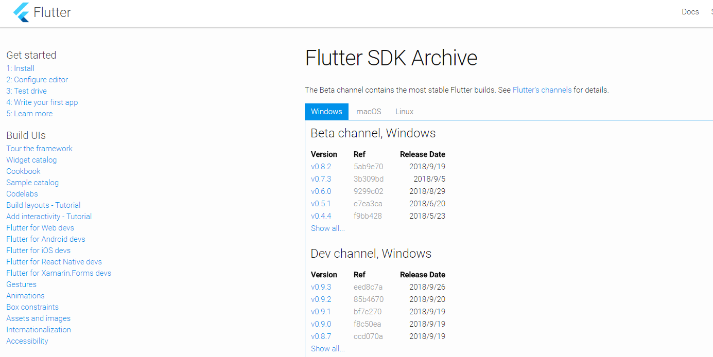
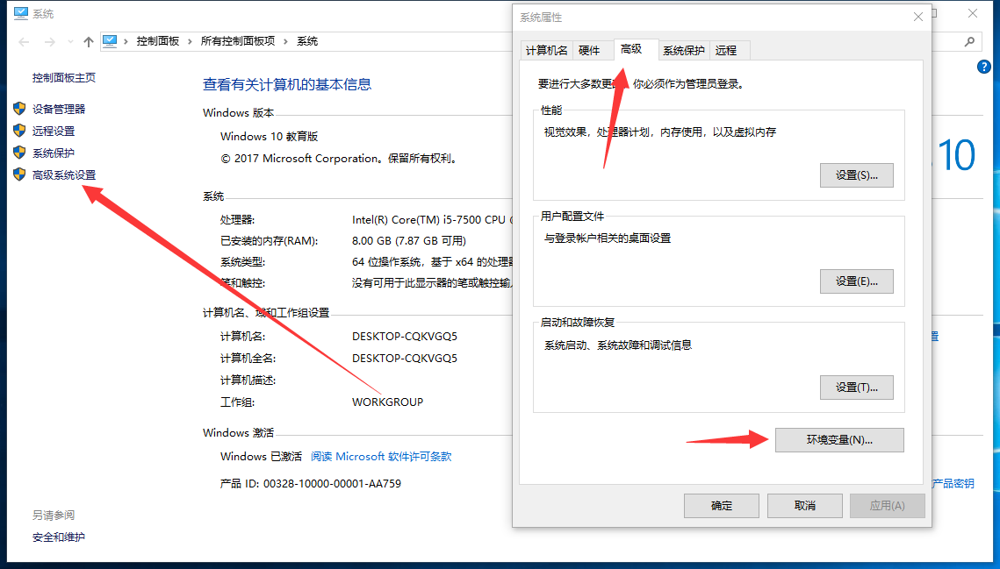
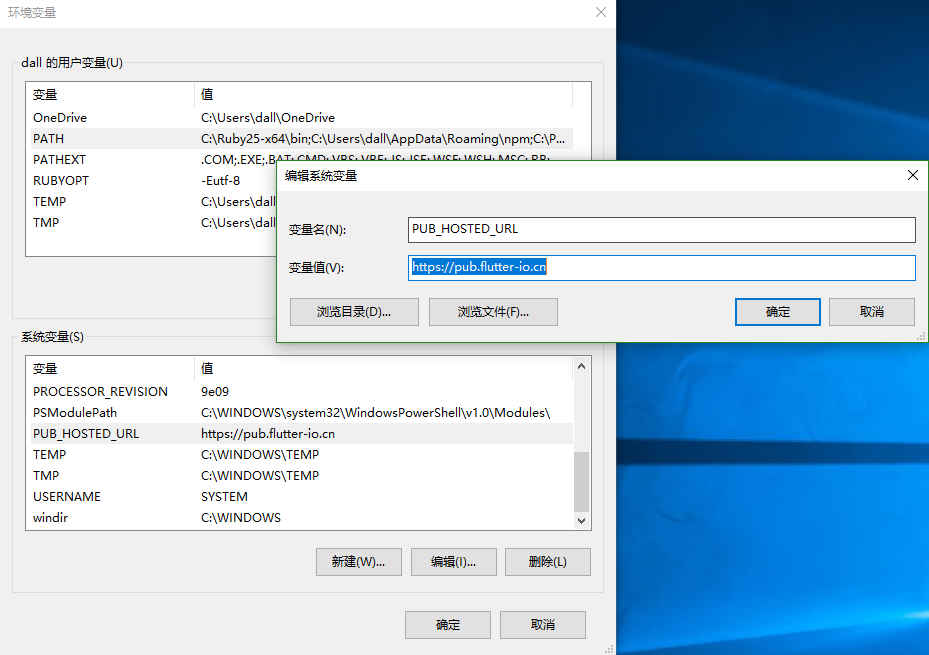
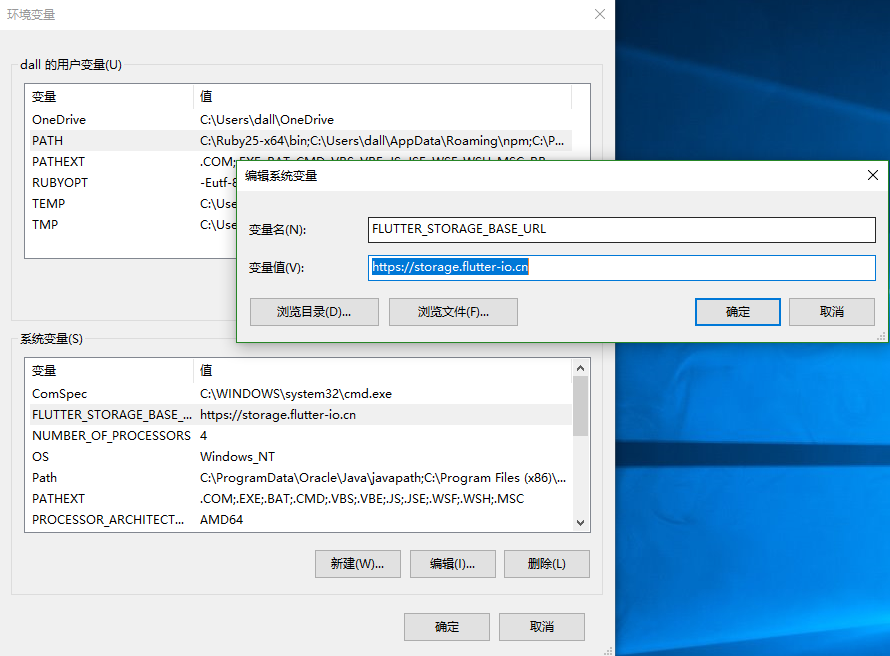
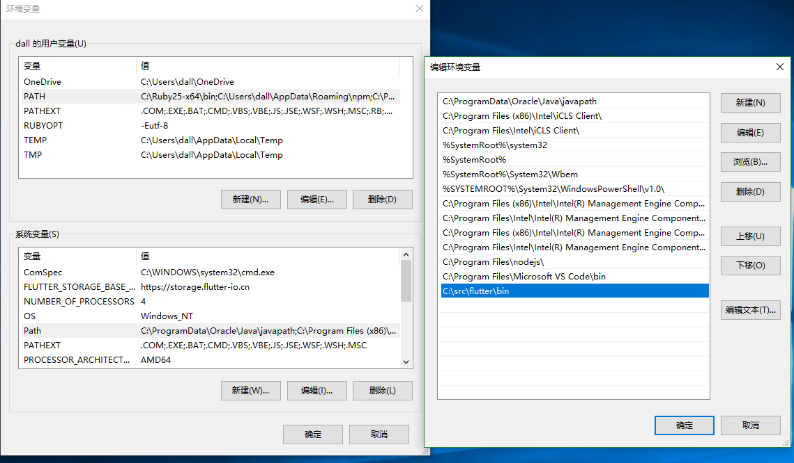

## Windows

### 1. 下载安装包

因为下载安装包需要一定的时间，所以先把进行安装包的下载。
可以去官网下载：[Download Flutter](https://flutter.io/sdk-archive/#windows)

可以去 Flutter github 下载安装包：[Download Flutter Zip](https://github.com/flutter/flutter/releases)

### 2. 配置环境变量

```
PUB_HOSTED_URL = https://pub.flutter-io.cn
FLUTTER_STORAGE_BASE_URL = https://storage.flutter-io.cn
```

在 **等待下载** 过程中配置一下环境变量

1. 右键我的电脑(此电脑) > 属性 > 高级系统保护设置 > 高级 > 环境变量
   
   

2. 在 系统变量 下点击新建（可以将上面代码复制）：
   
   

在 **下载完安装包** 后，

1. 把它解压到你想安装 Flutter SDK 的路径（我是在 `C:\src\flutter`）
   
2. 在 系统变量 下检查是否有名为“Path(PATH)”的条目:

- 如果该条目存在，左键双击击进入该项 编辑 > 新增
- 如果条目不存在, 点击下面 新建, 变量名为 `Path` ，变量值为 `C:\src\flutter\bin`
  

### 3. 运行 Flutter doctor
